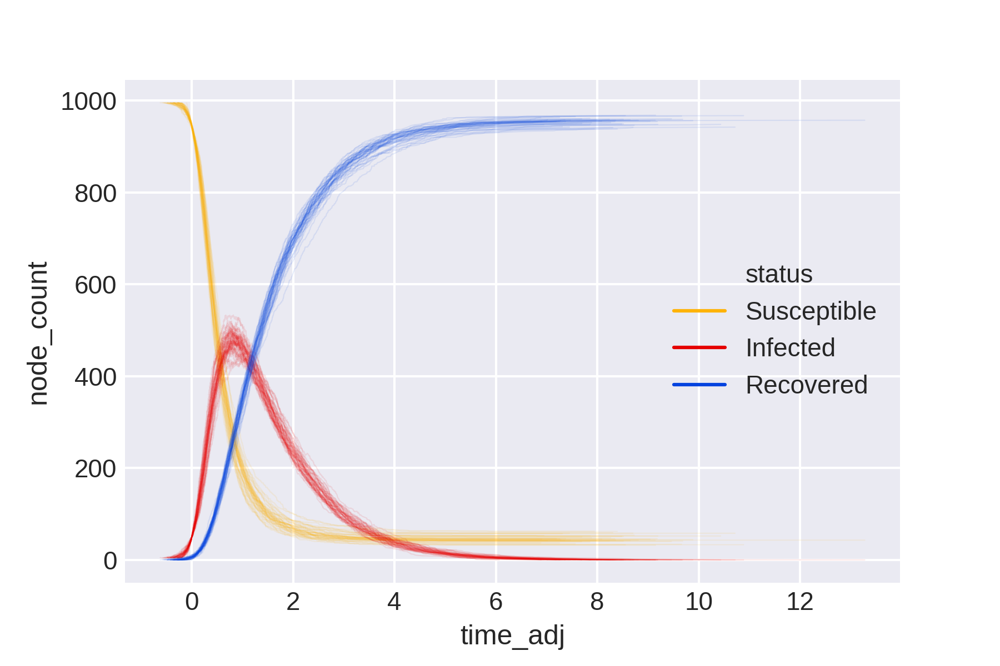

# data-science #

This repository contains examples of work in data science and analytics.

### Epidemics: stochastic processes on networks

epidemics.py contains a Python implementation of an SIR infection model, which simulates the spread of an infectious disease through a networked population. The model simulates infection as a per-edge Poisson point process and uses the event-queue method.

The file contains two functions. 

The **SIR function** takes arg *G* (a networkx graph object) and kwargs *i_rate* (per-edge infection rate), *r_rate* (recovery rate), *init* (number of initial infections), and *max_time* (maximum time to run the simulation; since SIR models should always reach equilibrium infinite loops should not occur, but this kwarg is included on a belt-and-braces basis).

The **timeshift function** is an auxiliary function which aligns multiple model runs with time = 0 at the specified threshold level of infections. It takes two args and two kwargs. The positional arguments are: *df* (a Pandas dataframe containing model output), and *threshold* (the number of infections to set at time = 0). The two keyword arguments can be ignored if using output from the SIR function. They specify the criterion to which the threshold value relates (*criteria*), and the dataframe column containing the time values (*time*).

Together, these functions allow multiple model runs to be collated and aligned. It is straightforward to then, for example, plot the results:

 

#### Swapchain: network-based allocation ####

swapchain.py was written to help a colleague in a history department manage module changes in a situation where most modules are full. The algorithm identifies all of the viable chains of module swaps from a given waiting list and outputs the necessary steps (chains may be mutually exclusive).

**Caveat:** This script was written to assist a human coordinator and not to automate the process of module changes. Bi- and trilateral swaps are often possible to identify 'by eye', but longer chains of swaps can be difficult to spot. The script finds chains of swaps, and only within this prioritises students on a first-come, first-served (fcfs) basis. This may not accord with procedural fairness. E.g. a student who has been waiting months and could have a place through a chain of three swaps, could miss out to a student who just joined the waiting list but who would get a place as part of six swaps. Weighing 'greatest number' vs fcfs is left to human judgement in accordance with departmental norms, 

**Details:** The script imports the waiting_list.csv from the Data directory, and represents it as a directed multigraph. It then uses NetworkX's *simple cycle* function to identify cycles (which corresponds to chains of viable swaps) and outputs all viable chains of swaps as swapchain.csv in the Data directory, sorted with the longest chains at the top. The data included are synthetic, combining fake student names with real module names. Chains may be (probably are) mutually exclusive. The user should choose one chain, action it, update the waiting list, and then run the script again to identify further viable swaps. 

